# postfix-smtp-relay

A Postfix SMTP relay configuration to run Postfix as an SMTP relay server on Ubuntu. In this setup, Postfix accepts outgoing mail from clients or applications and forwards (relays) it to another SMTP server for actual delivery.

## Architecture Overview

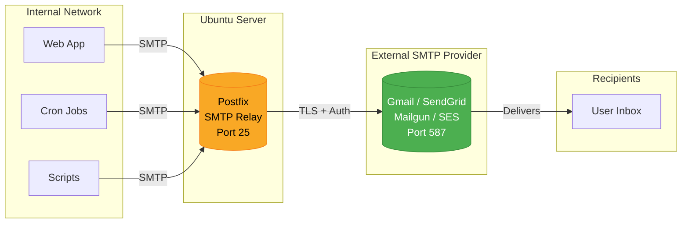

## How It Works

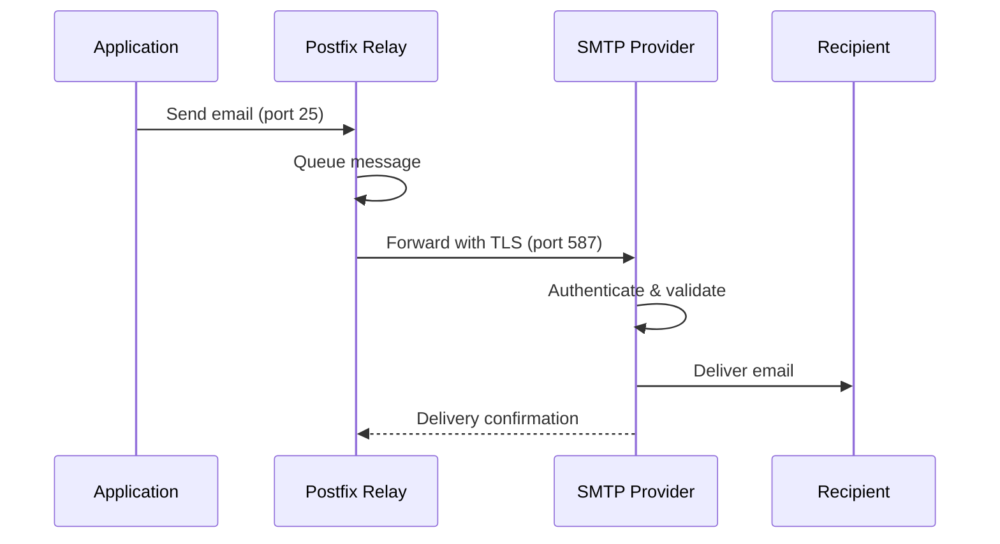

## Prerequisites

- Ubuntu Server 20.04/22.04/24.04 LTS
- Root or sudo access
- Valid SMTP relay credentials (Gmail, SendGrid, Mailgun, etc.)

## Setup Overview

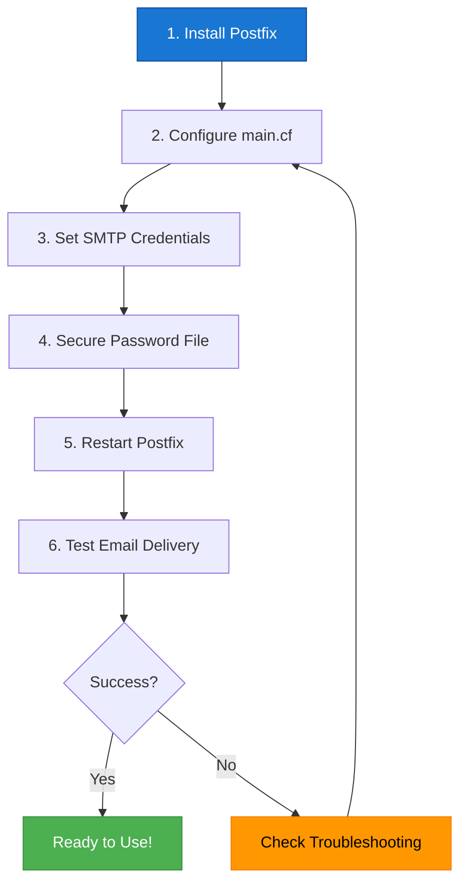

## Installation

### 1. Update System and Install Postfix

```bash
sudo apt update && sudo apt upgrade -y
sudo apt install postfix libsasl2-modules mailutils -y
```

During installation, select **"Internet Site"** when prompted and enter your server's FQDN.

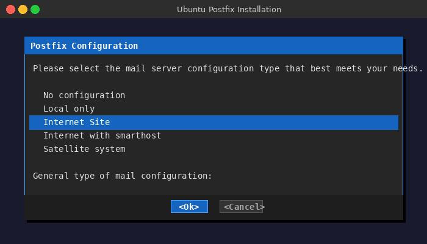
*Select "Internet Site" during Postfix installation*

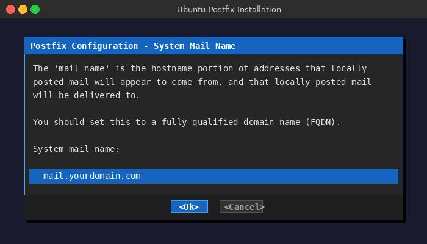
*Enter your server's fully qualified domain name*

> **Tip:** To skip the interactive prompts, pre-seed the configuration before installing:
> ```bash
> sudo debconf-set-selections <<< "postfix postfix/mailname string $(hostname -f)"
> sudo debconf-set-selections <<< "postfix postfix/main_mailer_type string 'Internet Site'"
> sudo apt install -y postfix libsasl2-modules mailutils
> ```

### 2. Deploy Configuration Files

Back up any existing Postfix configuration:

```bash
sudo cp /etc/postfix/main.cf /etc/postfix/main.cf.bak
```

Copy the configuration files from this repository to Postfix:

```bash
sudo cp postfix-config/main.cf /etc/postfix/main.cf
sudo cp postfix-config/sasl_passwd /etc/postfix/sasl_passwd
sudo cp postfix-config/sender_access /etc/postfix/sender_access
sudo cp postfix-config/recipient_access /etc/postfix/recipient_access
```

### 3. Configure Postfix Main Settings

Edit the main configuration file:

```bash
sudo nano /etc/postfix/main.cf
```

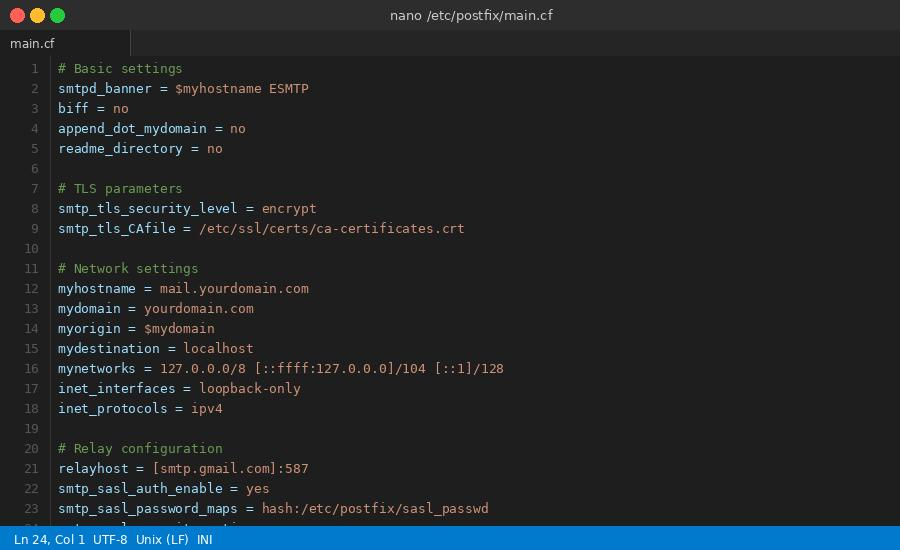
*Editing the Postfix main configuration file*

Replace or add the following configuration:

```ini
# Basic settings
smtpd_banner = $myhostname ESMTP
biff = no
append_dot_mydomain = no
readme_directory = no

# TLS parameters
smtp_tls_security_level = encrypt
smtp_tls_CAfile = /etc/ssl/certs/ca-certificates.crt

# Network settings
myhostname = your-server-hostname
mydomain = yourdomain.com
myorigin = $mydomain
mydestination = localhost
mynetworks = 127.0.0.0/8 [::ffff:127.0.0.0]/104 [::1]/128
inet_interfaces = loopback-only
inet_protocols = ipv4

# Relay configuration
relayhost = [smtp.gmail.com]:587
smtp_sasl_auth_enable = yes
smtp_sasl_password_maps = hash:/etc/postfix/sasl_passwd
smtp_sasl_security_options = noanonymous
smtp_use_tls = yes
```

### 4. Configure SMTP Credentials

Create the password file:

```bash
sudo nano /etc/postfix/sasl_passwd
```

Add your relay credentials:

```
[smtp.gmail.com]:587 your-email@gmail.com:your-app-password
```

Secure the credentials:

```bash
sudo postmap /etc/postfix/sasl_passwd
sudo chmod 600 /etc/postfix/sasl_passwd /etc/postfix/sasl_passwd.db
sudo chown root:root /etc/postfix/sasl_passwd /etc/postfix/sasl_passwd.db
```

Build the sender and recipient restriction hash maps:

```bash
sudo postmap /etc/postfix/sender_access
sudo postmap /etc/postfix/recipient_access
```

### 5. Restart Postfix

```bash
sudo systemctl restart postfix
sudo systemctl enable postfix
```

## Common Relay Host Configurations

### Gmail

```ini
relayhost = [smtp.gmail.com]:587
```

**Note:** Use an [App Password](https://support.google.com/accounts/answer/185833) instead of your regular password.

#### Creating a Gmail App Password

1. Go to [Google Account Security](https://myaccount.google.com/security)
2. Enable 2-Step Verification if not already enabled
3. Navigate to **App passwords**
4. Select "Mail" and your device, then click "Generate"

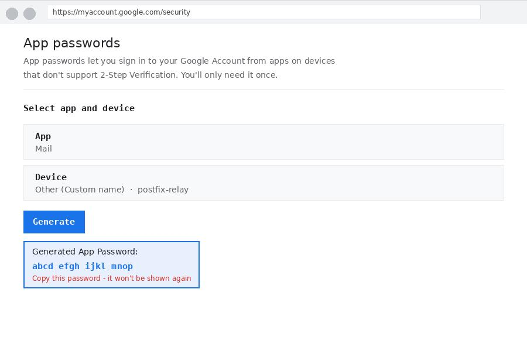
*Generating an App Password in Google Account settings*

### SendGrid

```ini
relayhost = [smtp.sendgrid.net]:587
```

Credentials format: `apikey:your-sendgrid-api-key`

### Amazon SES

```ini
relayhost = [email-smtp.us-east-1.amazonaws.com]:587
```

### Mailgun

```ini
relayhost = [smtp.mailgun.org]:587
```

## Testing

### Send a Test Email

```bash
echo "This is a test email from Postfix relay" | mail -s "Test Email" recipient@example.com
```

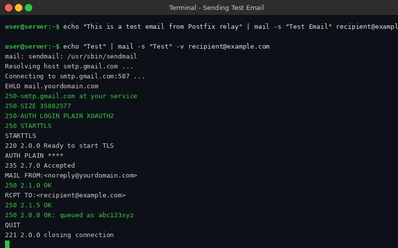
*Sending a test email from the terminal*

### Check Mail Queue

```bash
mailq
```

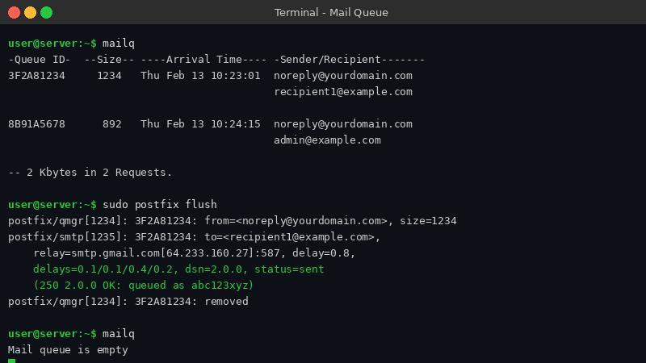
*Checking the mail queue for pending messages*

### View Mail Logs

```bash
sudo tail -f /var/log/mail.log
```

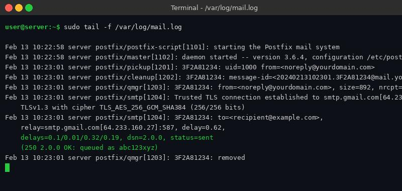
*Monitoring mail logs for delivery status*

### Flush Mail Queue

```bash
sudo postfix flush
```

## Allowing Internal Network Clients

To allow other servers on your network to relay through this server, update `mynetworks`:

```ini
mynetworks = 127.0.0.0/8 192.168.1.0/24
inet_interfaces = all
```

Then restart Postfix:

```bash
sudo systemctl restart postfix
```

## Troubleshooting

### Troubleshooting Flowchart

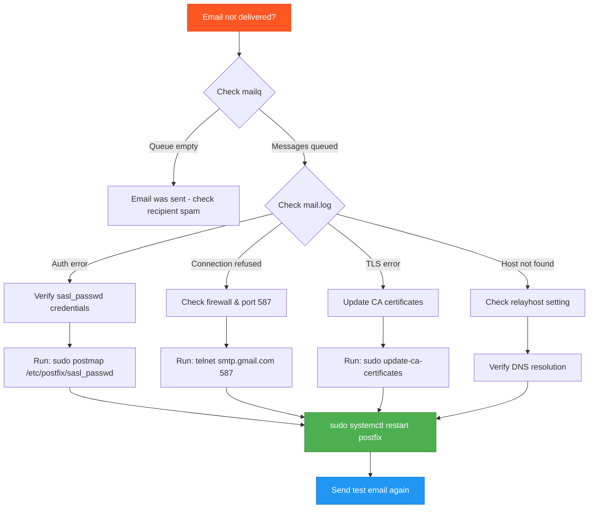

### Common Issues

**Authentication Failed**
- Verify credentials in `/etc/postfix/sasl_passwd`
- For Gmail, ensure you're using an App Password
- Run `sudo postmap /etc/postfix/sasl_passwd` after any changes

**Connection Refused**
- Check if port 587 is open: `telnet smtp.gmail.com 587`
- Verify firewall settings: `sudo ufw status`

**Mail Stuck in Queue**
- Check logs: `sudo tail -100 /var/log/mail.log`
- View queue: `mailq`
- Delete all queued mail: `sudo postsuper -d ALL`

**TLS Certificate Errors**
- Update CA certificates: `sudo apt install ca-certificates && sudo update-ca-certificates`

### Useful Commands

```bash
# Check Postfix configuration
sudo postfix check

# View current configuration
postconf -n

# Test email delivery
echo "Test" | mail -s "Test" -v recipient@example.com

# Monitor real-time logs
sudo journalctl -u postfix -f
```

## Security Considerations

1. **Restrict relay access** - Only allow trusted networks in `mynetworks`
2. **Use TLS** - Always encrypt SMTP connections
3. **Protect credentials** - Ensure proper file permissions on `sasl_passwd`
4. **Rate limiting** - Configure rate limits to prevent abuse
5. **Monitor logs** - Regularly check for unauthorized relay attempts

## Firewall Configuration

If using UFW:

```bash
# Allow SMTP from local network only
sudo ufw allow from 192.168.1.0/24 to any port 25
```

## Successful Delivery

When everything is configured correctly, you should see delivery confirmation in the logs:

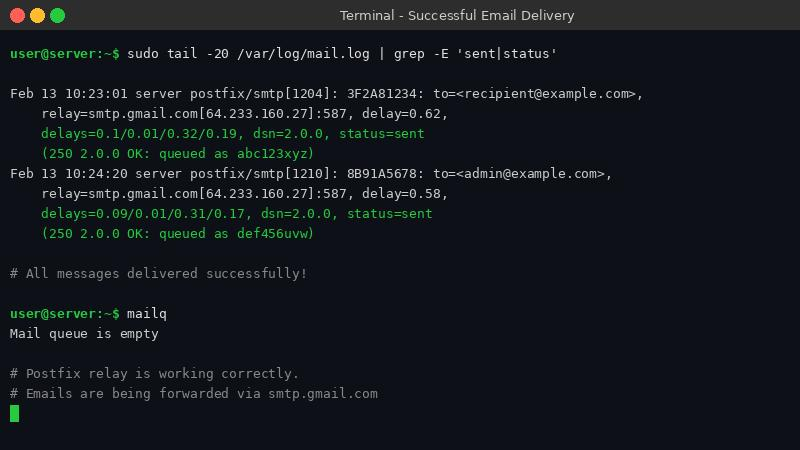
*Mail log showing successful email delivery*

The recipient should receive the email in their inbox:

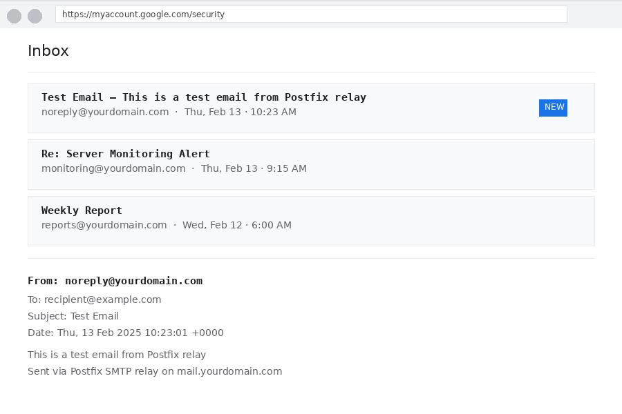
*Test email received in recipient's inbox*

## Screenshots

This repository includes placeholder references for the following screenshots. To add your own:

1. Capture screenshots during your setup process
2. Save them as JPEG files in the `images/` directory
3. Use the following filenames:

| Filename | Description |
|----------|-------------|
| `postfix-install-type.jpg` | Postfix installation dialog showing "Internet Site" selection |
| `postfix-mail-name.jpg` | System mail name configuration prompt |
| `postfix-main-cf.jpg` | The main.cf file open in an editor |
| `gmail-app-password.jpg` | Google Account App Password generation page |
| `send-test-email.jpg` | Terminal showing the mail command |
| `mailq-output.jpg` | Output of the mailq command |
| `mail-log.jpg` | Contents of /var/log/mail.log |
| `successful-delivery.jpg` | Log showing successful delivery status |
| `email-received.jpg` | Screenshot of received email in inbox |

## License

MIT License
