# postfix-smtp-relay

A Postfix SMTP relay configuration to run Postfix as an SMTP relay server on Ubuntu. In this setup, Postfix accepts outgoing mail from clients or applications and forwards (relays) it to another SMTP server for actual delivery.

## Architecture Overview

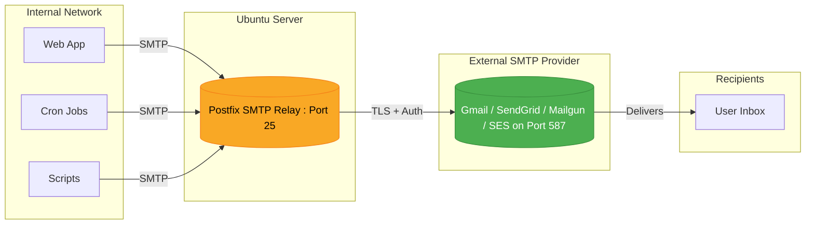
```mermaid
flowchart LR
    subgraph Internal["Internal Network"]
        A[Web App]
        B[Cron Jobs]
        C[Scripts]
    end

    subgraph Server["Ubuntu Server"]
        D[("Postfix SMTP Relay : Port 25")]
    end

    subgraph External["External SMTP Provider"]
        E[("Gmail / SendGrid / Mailgun / SES on Port 587")]
    end

    subgraph Recipients["Recipients"]
        F[User Inbox]
    end

    A -->|SMTP| D
    B -->|SMTP| D
    C -->|SMTP| D
    D -->|TLS + Auth| E
    E -->|Delivers| F

    style D fill:#f9a825,stroke:#f57f17,color:#000
    style E fill:#4caf50,stroke:#388e3c,color:#fff
```

## How It Works

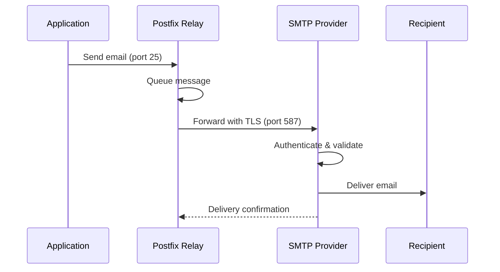
```mermaid
sequenceDiagram
    participant App as Application
    participant Postfix as Postfix Relay
    participant Provider as SMTP Provider
    participant Recipient as Recipient

    App->>Postfix: Send email (port 25)
    Postfix->>Postfix: Queue message
    Postfix->>Provider: Forward with TLS (port 587)
    Provider->>Provider: Authenticate & validate
    Provider->>Recipient: Deliver email
    Provider-->>Postfix: Delivery confirmation
```

## Prerequisites

- Ubuntu Server 20.04/22.04/24.04 LTS
- Root or sudo access
- Valid SMTP relay credentials (Gmail, SendGrid, Mailgun, etc.)

## Setup Overview

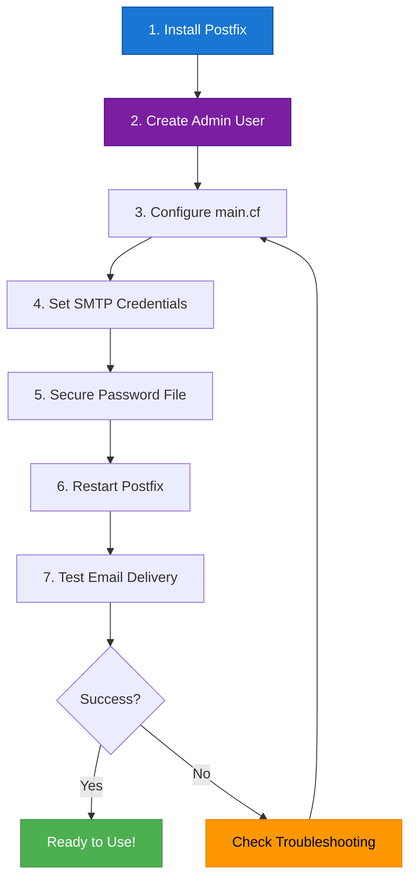
```mermaid
flowchart TD
    A[1. Install Postfix] --> A2[2. Create Admin User]
    A2 --> B[3. Configure main.cf]
    B --> C[4. Set SMTP Credentials]
    C --> D[5. Secure Password File]
    D --> E[6. Restart Postfix]
    E --> F[7. Test Email Delivery]
    F --> G{Success?}
    G -->|Yes| H[Ready to Use!]
    G -->|No| I[Check Troubleshooting]
    I --> B

    style A fill:#1976d2,stroke:#0d47a1,color:#fff
    style A2 fill:#7b1fa2,stroke:#4a148c,color:#fff
    style H fill:#4caf50,stroke:#388e3c,color:#fff
    style I fill:#ff9800,stroke:#f57c00,color:#000
```

## Automated Deployment

For a fully automated setup, use the deployment script:

```bash
git clone https://github.com/Buddhika-Kuruppu/postfix-smtp-relay.git
cd postfix-smtp-relay
sudo bash deploy.sh
```

The script will interactively prompt for all configuration values including the admin user, SMTP credentials, and relay settings.

## Manual Installation

### 1. Update System and Install Postfix

```bash
sudo apt update && sudo apt upgrade -y
sudo apt install postfix libsasl2-modules mailutils -y
```

During installation, select **"Internet Site"** when prompted and enter your server's FQDN.

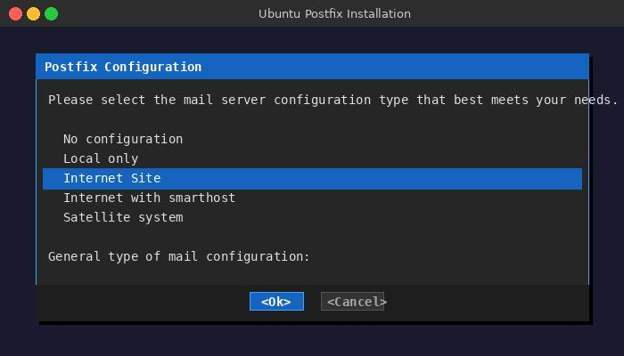
*Select "Internet Site" during Postfix installation*

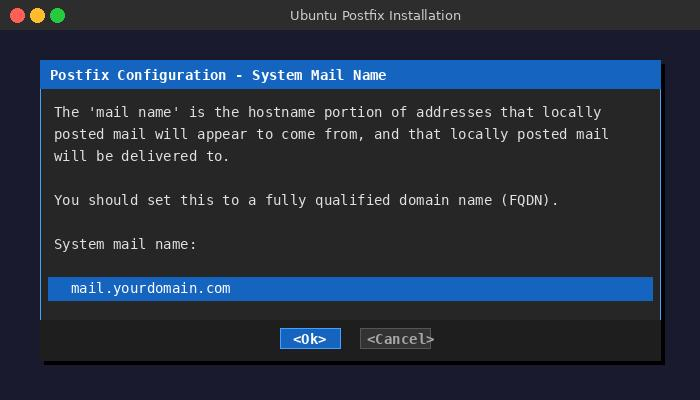
*Enter your server's fully qualified domain name*

> **Tip:** To skip the interactive prompts, pre-seed the configuration before installing:
> ```bash
> sudo debconf-set-selections <<< "postfix postfix/mailname string $(hostname -f)"
> sudo debconf-set-selections <<< "postfix postfix/main_mailer_type string 'Internet Site'"
> sudo apt install -y postfix libsasl2-modules mailutils
> ```

### 2. Create Dedicated Admin User

Create a dedicated user for managing the Postfix relay instead of using root directly:

```bash
sudo useradd --create-home --shell /bin/bash --comment "Postfix SMTP Relay Admin" postfix-admin
sudo passwd postfix-admin
```

Add the user to the `postfix` group so it can read Postfix configs and view the queue:

```bash
sudo usermod -aG postfix postfix-admin
```

Grant limited sudo access for Postfix management only:

```bash
sudo visudo -f /etc/sudoers.d/postfix-admin
```

Add the following rules:

```
# Postfix SMTP Relay — admin privileges for postfix-admin
postfix-admin ALL=(root) NOPASSWD: /usr/sbin/postfix *
postfix-admin ALL=(root) NOPASSWD: /usr/sbin/postmap *
postfix-admin ALL=(root) NOPASSWD: /usr/sbin/postconf *
postfix-admin ALL=(root) NOPASSWD: /usr/sbin/postsuper *
postfix-admin ALL=(root) NOPASSWD: /usr/bin/systemctl restart postfix
postfix-admin ALL=(root) NOPASSWD: /usr/bin/systemctl reload postfix
postfix-admin ALL=(root) NOPASSWD: /usr/bin/systemctl status postfix
postfix-admin ALL=(root) NOPASSWD: /usr/bin/systemctl stop postfix
postfix-admin ALL=(root) NOPASSWD: /usr/bin/systemctl start postfix
postfix-admin ALL=(root) NOPASSWD: /usr/bin/journalctl -u postfix *
postfix-admin ALL=(root) NOPASSWD: /usr/bin/tail -f /var/log/mail.log
postfix-admin ALL=(root) NOPASSWD: /usr/bin/tail -n * /var/log/mail.log
```

Verify the sudoers syntax:

```bash
sudo visudo -cf /etc/sudoers.d/postfix-admin
```

> **What this user can do:**
> - Start, stop, restart, and reload Postfix
> - Rebuild hash maps (`postmap`), manage the queue (`postsuper`), view config (`postconf`)
> - Read mail logs
>
> **What this user cannot do:**
> - Install or remove packages
> - Modify system files outside of Postfix commands
> - Access root shell

### 3. Deploy Configuration Files

Back up any existing Postfix configuration:

```bash
sudo cp /etc/postfix/main.cf /etc/postfix/main.cf.bak
```

Copy the configuration files from this repository to Postfix:

```bash
sudo cp postfix-config/main.cf /etc/postfix/main.cf
sudo cp postfix-config/sasl_passwd /etc/postfix/sasl_passwd
sudo cp postfix-config/sender_access /etc/postfix/sender_access
sudo cp postfix-config/recipient_access /etc/postfix/recipient_access
```

### 4. Configure Postfix Main Settings

Edit the main configuration file:

```bash
sudo nano /etc/postfix/main.cf
```

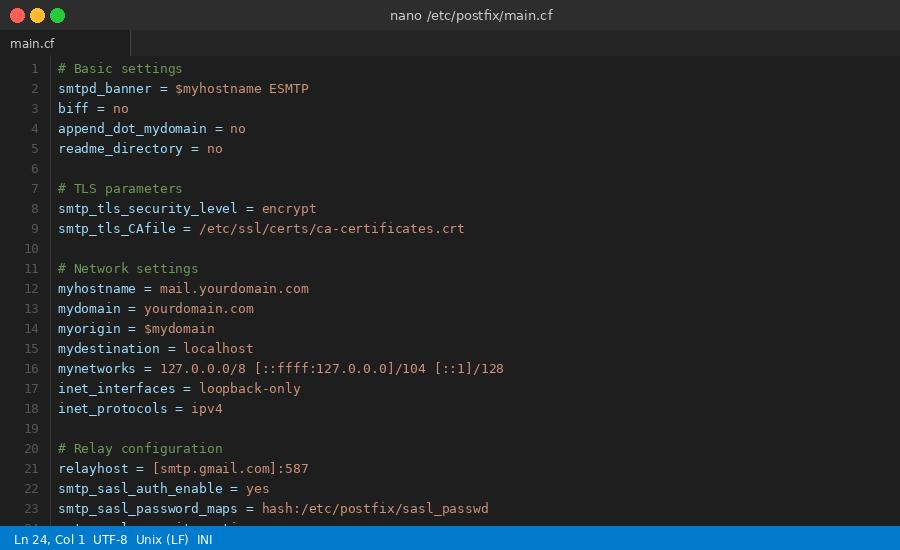
*Editing the Postfix main configuration file*

Replace or add the following configuration:

```ini
# Basic settings
smtpd_banner = $myhostname ESMTP
biff = no
append_dot_mydomain = no
readme_directory = no

# TLS parameters
smtp_tls_security_level = encrypt
smtp_tls_CAfile = /etc/ssl/certs/ca-certificates.crt

# Network settings
myhostname = your-server-hostname
mydomain = yourdomain.com
myorigin = $mydomain
mydestination = localhost
mynetworks = 127.0.0.0/8 [::ffff:127.0.0.0]/104 [::1]/128
inet_interfaces = loopback-only
inet_protocols = ipv4

# Relay configuration
relayhost = [smtp.gmail.com]:587
smtp_sasl_auth_enable = yes
smtp_sasl_password_maps = hash:/etc/postfix/sasl_passwd
smtp_sasl_security_options = noanonymous
smtp_use_tls = yes
```

### 5. Configure SMTP Credentials

Create the password file:

```bash
sudo nano /etc/postfix/sasl_passwd
```

Add your relay credentials:

```
[smtp.gmail.com]:587 your-email@gmail.com:your-app-password
```

Secure the credentials:

```bash
sudo postmap /etc/postfix/sasl_passwd
sudo chmod 600 /etc/postfix/sasl_passwd /etc/postfix/sasl_passwd.db
sudo chown root:root /etc/postfix/sasl_passwd /etc/postfix/sasl_passwd.db
```

Build the sender and recipient restriction hash maps:

```bash
sudo postmap /etc/postfix/sender_access
sudo postmap /etc/postfix/recipient_access
```

### 6. Restart Postfix

```bash
sudo systemctl restart postfix
sudo systemctl enable postfix
```

## Common Relay Host Configurations

### Gmail

```ini
relayhost = [smtp.gmail.com]:587
```

**Note:** Use an [App Password](https://support.google.com/accounts/answer/185833) instead of your regular password.

#### Creating a Gmail App Password

1. Go to [Google Account Security](https://myaccount.google.com/security)
2. Enable 2-Step Verification if not already enabled
3. Navigate to **App passwords**
4. Select "Mail" and your device, then click "Generate"

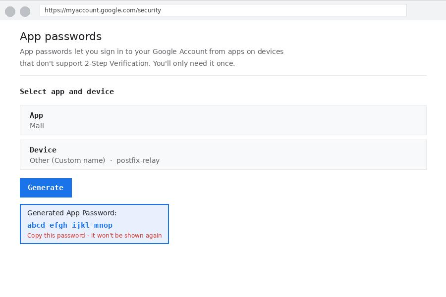
*Generating an App Password in Google Account settings*

### SendGrid

```ini
relayhost = [smtp.sendgrid.net]:587
```

Credentials format: `apikey:your-sendgrid-api-key`

### Amazon SES

```ini
relayhost = [email-smtp.us-east-1.amazonaws.com]:587
```

### Mailgun

```ini
relayhost = [smtp.mailgun.org]:587
```

## Testing

### Send a Test Email

```bash
echo "This is a test email from Postfix relay" | mail -s "Test Email" recipient@example.com
```

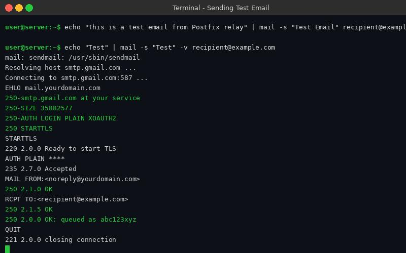
*Sending a test email from the terminal*

## Log Management

Postfix writes mail logs to `/var/log/mail.log` (or `/var/log/mail/mail.log` on some distributions). Systemd-managed systems can also query logs via `journalctl`.

### View Live Logs

Stream logs in real time to monitor delivery as it happens:

```bash
sudo tail -f /var/log/mail.log
```

Using journalctl (systemd):

```bash
sudo journalctl -u postfix -f
```

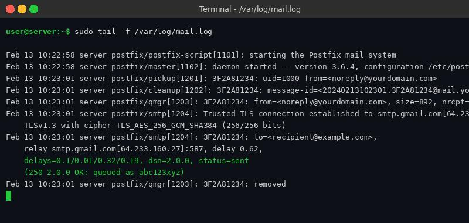
*Monitoring mail logs for delivery status*

### View Recent Log Entries

```bash
# Last 100 lines
sudo tail -n 100 /var/log/mail.log

# Last N lines via journalctl
sudo journalctl -u postfix -n 200
```

### Filter Logs by Time

```bash
# Logs since a specific date/time
sudo journalctl -u postfix --since "2024-01-01 08:00:00"

# Logs between two timestamps
sudo journalctl -u postfix --since "2024-01-01" --until "2024-01-02"

# Logs from the last hour
sudo journalctl -u postfix --since "1 hour ago"
```

### Analyze Logs for Errors and Events

Search for delivery status and common issues:

```bash
# Show all delivery failures
sudo grep -i "status=bounced\|status=deferred" /var/log/mail.log

# Show successful deliveries
sudo grep "status=sent" /var/log/mail.log

# Show authentication errors
sudo grep -i "authentication failed\|SASL" /var/log/mail.log

# Show connection errors to relay host
sudo grep -i "connection refused\|connect to" /var/log/mail.log

# Show TLS-related entries
sudo grep -i "TLS\|certificate" /var/log/mail.log

# Count deliveries by status
sudo grep "status=" /var/log/mail.log | grep -oP "status=\K\w+" | sort | uniq -c | sort -rn
```

### Search Logs for a Specific Recipient or Message

```bash
# Find all log entries for a specific recipient
sudo grep "recipient@example.com" /var/log/mail.log

# Find log entries for a specific queue ID
sudo grep "ABC123DEF" /var/log/mail.log
```

## Message Queue Management

Postfix maintains a mail queue for messages that are pending delivery, deferred, or held. Queue IDs are used to reference individual messages across all queue commands.

### Check Queue Status

```bash
mailq
```

Or equivalently:

```bash
postqueue -p
```

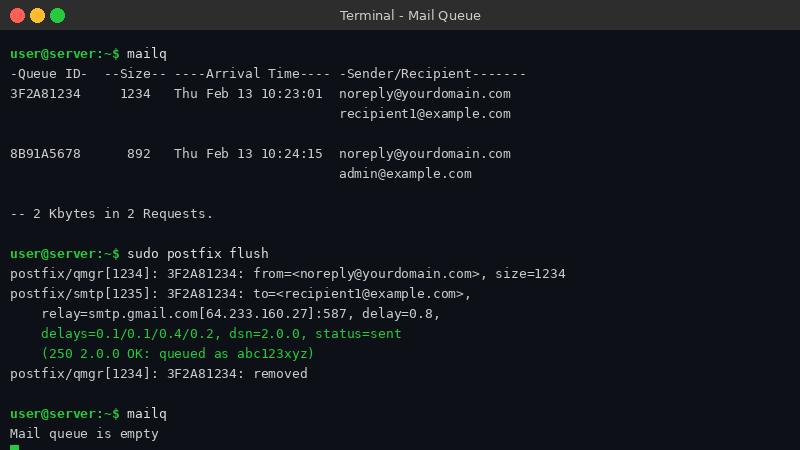
*Checking the mail queue for pending messages*

### View Queue Summary

```bash
# Count messages by queue type
postqueue -p | tail -n 1

# Show a summary of deferred mail
postqueue -p | grep "^[A-Z0-9]" | wc -l
```

### Inspect a Specific Message

```bash
# View headers and metadata for a message by queue ID
sudo postcat -q <queue-id>

# View the full message body
sudo postcat -qB <queue-id>
```

### Flush the Queue

Force Postfix to attempt immediate delivery of all queued messages:

```bash
sudo postqueue -f
```

Or via the Postfix control command:

```bash
sudo postfix flush
```

### Delete Messages from the Queue

```bash
# Delete a specific message by queue ID
sudo postsuper -d <queue-id>

# Delete ALL queued messages (use with caution)
sudo postsuper -d ALL

# Delete only deferred messages
sudo postsuper -d ALL deferred
```

### Hold and Release Messages

Holding a message prevents delivery without deleting it:

```bash
# Place a specific message on hold
sudo postsuper -h <queue-id>

# Hold ALL queued messages
sudo postsuper -h ALL

# Release a held message back to the active queue
sudo postsuper -H <queue-id>

# Release ALL held messages
sudo postsuper -H ALL
```

### Re-queue a Message

Move a message back to the incoming queue to force a re-processing attempt:

```bash
sudo postsuper -r <queue-id>

# Re-queue all deferred messages
sudo postsuper -r ALL deferred
```

## Allowing Internal Network Clients

To allow other servers on your network to relay through this server, update `mynetworks`:

```ini
mynetworks = 127.0.0.0/8 192.168.1.0/24
inet_interfaces = all
```

Then restart Postfix:

```bash
sudo systemctl restart postfix
```

## Troubleshooting

### Troubleshooting Flowchart

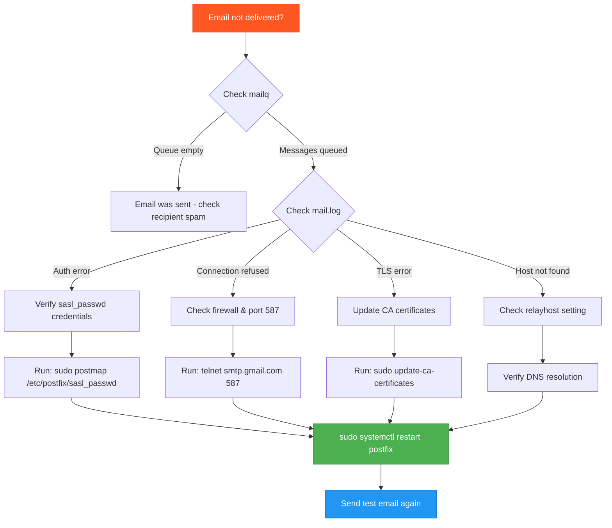
```mermaid
flowchart TD
    A[Email not delivered?] --> B{Check mailq}
    B -->|Queue empty| C[Email was sent - check recipient spam]
    B -->|Messages queued| D{Check mail.log}

    D -->|Auth error| E[Verify sasl_passwd credentials]
    D -->|Connection refused| F[Check firewall & port 587]
    D -->|TLS error| G[Update CA certificates]
    D -->|Host not found| H[Check relayhost setting]

    E --> I[Run: sudo postmap /etc/postfix/sasl_passwd]
    F --> J[Run: telnet smtp.gmail.com 587]
    G --> K[Run: sudo update-ca-certificates]
    H --> L[Verify DNS resolution]

    I --> M[Restart Postfix]
    J --> M
    K --> M
    L --> M

    M[sudo systemctl restart postfix] --> N[Send test email again]

    style A fill:#ff5722,stroke:#e64a19,color:#fff
    style M fill:#4caf50,stroke:#388e3c,color:#fff
    style N fill:#2196f3,stroke:#1976d2,color:#fff
```

### Common Issues

**Authentication Failed**
- Verify credentials in `/etc/postfix/sasl_passwd`
- For Gmail, ensure you're using an App Password
- Run `sudo postmap /etc/postfix/sasl_passwd` after any changes

**Connection Refused**
- Check if port 587 is open: `telnet smtp.gmail.com 587`
- Verify firewall settings: `sudo ufw status`

**Mail Stuck in Queue**
- Check logs: `sudo tail -n 100 /var/log/mail.log`
- View queue: `mailq`
- Delete all queued mail: `sudo postsuper -d ALL`
- See [Message Queue Management](#message-queue-management) for full queue commands

**TLS Certificate Errors**
- Update CA certificates: `sudo apt install ca-certificates && sudo update-ca-certificates`

### Useful Commands

```bash
# Check Postfix configuration
sudo postfix check

# View current configuration
postconf -n

# Test email delivery
echo "Test" | mail -s "Test" -v recipient@example.com
```

For log commands see [Log Management](#log-management). For queue commands see [Message Queue Management](#message-queue-management).

## Security Considerations

1. **Use a dedicated admin user** - Never manage Postfix as root; use the `postfix-admin` user with scoped sudo
2. **Restrict relay access** - Only allow trusted networks in `mynetworks`
3. **Use TLS** - Always encrypt SMTP connections
4. **Protect credentials** - Ensure proper file permissions on `sasl_passwd`
5. **Rate limiting** - Configure rate limits to prevent abuse
6. **Monitor logs** - Regularly check for unauthorized relay attempts

## Firewall Configuration

If using UFW:

```bash
# Allow SMTP from local network only
sudo ufw allow from 192.168.1.0/24 to any port 25
```

## Successful Delivery

When everything is configured correctly, you should see delivery confirmation in the logs:

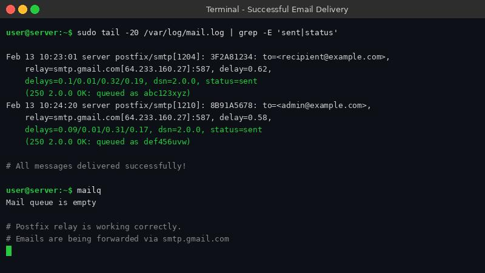
*Mail log showing successful email delivery*

The recipient should receive the email in their inbox:

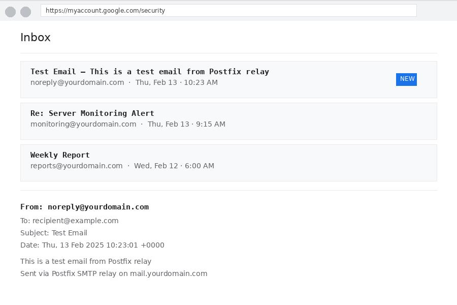
*Test email received in recipient's inbox*
