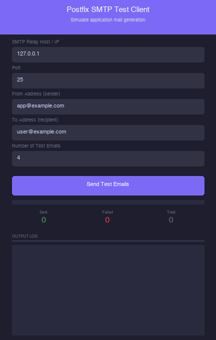
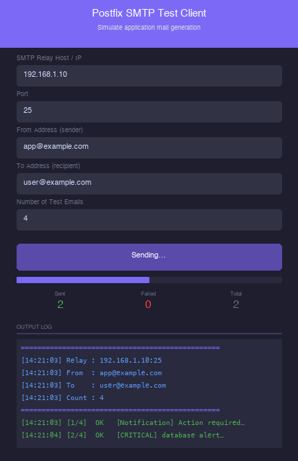
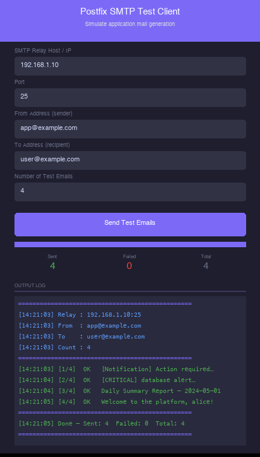
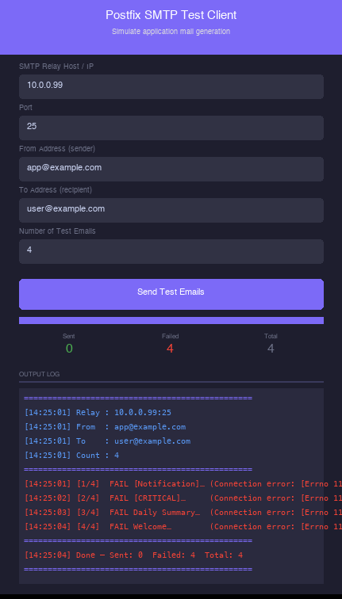
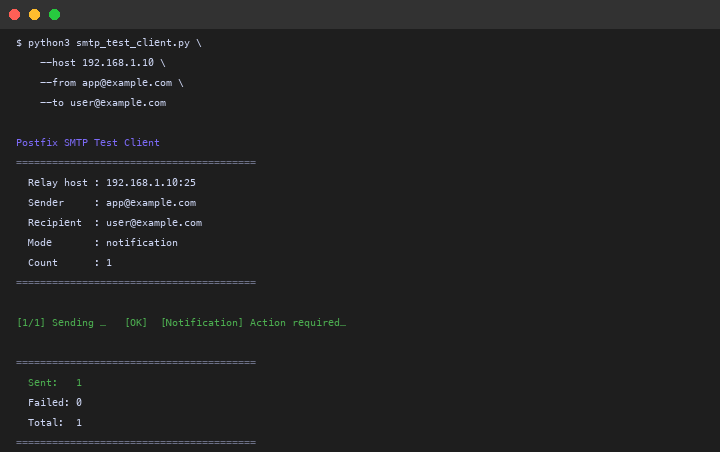
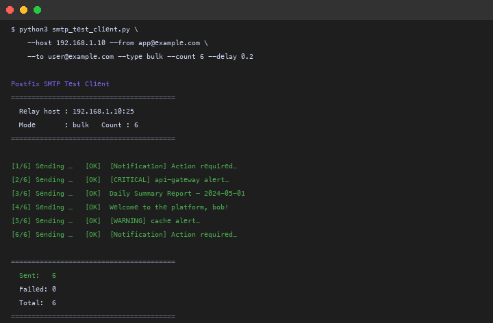
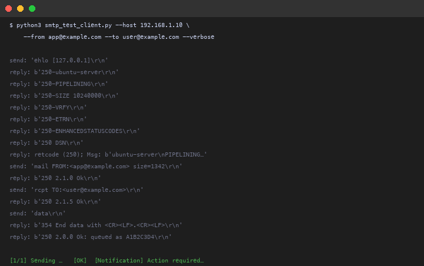

# Postfix SMTP Test Client

Tools for simulating application mail generation and sending test emails to a Postfix SMTP relay. Includes a command-line client and a graphical UI.

---

## Contents

```
test-client/
├── smtp_test_client.py       # CLI tool
├── smtp_test_client_ui.py    # GUI tool (Tkinter)
└── README.md                 # This file
```

**No external dependencies** — uses Python 3.10+ standard library only (`smtplib`, `tkinter`, `email`).

---

## Prerequisites

- Python 3.10 or later
- Network access from the test machine to the Postfix relay on the configured SMTP port (default: 25)
- The test machine's IP must be permitted by the relay's `mynetworks` setting or `client_ip_access` map

---

## GUI Tool

### Launch

```bash
python3 smtp_test_client_ui.py
```


*Main window of the SMTP Test Client GUI*

### How to use

Fill in the fields and click **Send Test Emails**.

| Field | Description | Default |
|---|---|---|
| SMTP Relay Host / IP | Hostname or IP address of your Postfix server | `127.0.0.1` |
| Port | SMTP port your relay listens on | `25` |
| From Address | Sender address used in the email envelope | `app@example.com` |
| To Address | Recipient address for all test emails | `user@example.com` |
| Number of Test Emails | How many emails to generate and send | `4` |

> **Mail types:** The GUI always sends a random shuffled mix of all four mail types (notification, alert, report, welcome). There is no type selector — use the CLI tool if you need to send a specific type.

> **Network requirement:** The machine running this tool must be able to reach the Postfix relay on the specified host and port. Check your `mynetworks` setting in `main.cf` to ensure your client IP is allowed.

### Sending emails

Click **Send Test Emails** to start. Each email is sent sequentially and the result appears in the output log in real time.


*Progress bar and live log during sending*

### Reading the output log

| Colour | Meaning |
|---|---|
| Green `OK` | Email accepted by the Postfix relay |
| Red `FAIL` | Relay rejected the connection or returned an SMTP error |

The stat counters at the bottom show a running tally of **Sent**, **Failed**, and **Total**.


*All emails accepted — green OK entries and Sent counter updated*


*Connection refused — red FAIL entries with the error reason*

---

## CLI Tool

### Usage

```bash
python3 smtp_test_client.py --from <sender> --to <recipient> [options]
```

```
options:
  --host HOST      Postfix relay hostname or IP  (default: 127.0.0.1)
  --port PORT      SMTP port                     (default: 25)
  --from ADDRESS   Sender address                (required)
  --to ADDRESS     Recipient address             (required)
  --type TYPE      Mail type to send             (default: notification)
  --count N        Number of emails to send      (default: 1)
  --delay SECS     Pause between emails          (default: 0)
  --timeout SECS   SMTP connection timeout       (default: 10)
  --verbose        Print raw SMTP conversation
```

### Mail types

| `--type` value | Description | Emails sent |
|---|---|---|
| `notification` | User login detected, with timestamp and source IP | `--count` |
| `alert` | System monitoring alert — INFO / WARNING / CRITICAL | `--count` |
| `report` | Daily summary with randomised tabular data | `--count` |
| `welcome` | New-user onboarding email | `--count` |
| `bulk` | Random mix of all types | `--count` |
| `all` | One of each type in sequence | 4 (ignores `--count`) |

> **Note:** `--type all` always sends exactly 4 emails (one notification, one alert, one report, one welcome) regardless of the `--count` value.

### Examples

**Send one notification:**

```bash
python3 smtp_test_client.py \
  --host 192.168.1.10 \
  --from app@example.com \
  --to user@example.com
```


*Sending a single notification email from the terminal*

**Send one of every type:**

```bash
python3 smtp_test_client.py \
  --host 192.168.1.10 \
  --from app@example.com \
  --to user@example.com \
  --type all
```

**Bulk test — 20 mixed emails, 200 ms apart:**

```bash
python3 smtp_test_client.py \
  --host 192.168.1.10 \
  --from app@example.com \
  --to user@example.com \
  --type bulk --count 20 --delay 0.2
```


*Bulk send summary showing sent and failed counts*

**Verbose mode (shows raw SMTP dialogue):**

```bash
python3 smtp_test_client.py \
  --host 192.168.1.10 \
  --from app@example.com \
  --to user@example.com \
  --type alert --verbose
```


*Verbose mode displaying the raw SMTP handshake*

### Exit codes

| Code | Meaning |
|---|---|
| `0` | All emails sent successfully |
| `1` | One or more emails failed |

---

## Test Cases

Use these scenarios to verify your relay's access controls are working correctly. Adjust the host, sender, and recipient addresses to match your deployment.

### TC-01 — Basic connectivity

Confirm the relay accepts a connection and delivers a test email from an allowed sender and recipient.

```bash
python3 smtp_test_client.py \
  --host 192.168.1.10 \
  --from app@yourdomain.com \
  --to user@yourdomain.com
```

**Expected:** `[OK]` — email accepted and relayed.

---

### TC-02 — All mail types delivered

Verify all four generated email formats pass through the relay without issue.

```bash
python3 smtp_test_client.py \
  --host 192.168.1.10 \
  --from app@yourdomain.com \
  --to user@yourdomain.com \
  --type all
```

**Expected:** 4 × `[OK]` — one notification, one alert, one report, one welcome.

---

### TC-03 — Sender blocked by `sender_access`

Confirm the relay rejects a sender from an unauthorised domain. Add a `REJECT` rule to `sender_access` for the test domain first, then rebuild the map:

```bash
# On the relay server
echo "blocked.com  REJECT" | sudo tee -a /etc/postfix/sender_access
sudo postmap /etc/postfix/sender_access && sudo systemctl reload postfix
```

```bash
python3 smtp_test_client.py \
  --host 192.168.1.10 \
  --from app@blocked.com \
  --to user@yourdomain.com
```

**Expected:** `[FAIL] SMTP error` with a 554 reject code.

---

### TC-04 — Recipient blocked by `recipient_access`

Confirm the relay rejects delivery to a blocked recipient address. Add a `REJECT` rule for the test recipient, then rebuild:

```bash
# On the relay server
echo "blocked@yourdomain.com  REJECT" | sudo tee -a /etc/postfix/recipient_access
sudo postmap /etc/postfix/recipient_access && sudo systemctl reload postfix
```

```bash
python3 smtp_test_client.py \
  --host 192.168.1.10 \
  --from app@yourdomain.com \
  --to blocked@yourdomain.com
```

**Expected:** `[FAIL] SMTP error` with a 554 reject code.

---

### TC-05 — Client IP blocked by `client_ip_access`

Confirm the relay refuses connections from an IP that is not in the allowlist. Add a `REJECT` rule for your test machine's IP, then rebuild:

```bash
# On the relay server — replace with the test client's actual IP
echo "192.168.1.50  REJECT" | sudo tee -a /etc/postfix/client_ip_access
sudo postmap /etc/postfix/client_ip_access && sudo systemctl reload postfix
```

```bash
python3 smtp_test_client.py \
  --host 192.168.1.10 \
  --from app@yourdomain.com \
  --to user@yourdomain.com
```

**Expected:** `[FAIL] Connection error` — the relay drops the connection at the network level.

---

### TC-06 — Bulk load test

Send a large batch of mixed emails to check relay throughput and confirm no messages are silently dropped.

```bash
python3 smtp_test_client.py \
  --host 192.168.1.10 \
  --from app@yourdomain.com \
  --to user@yourdomain.com \
  --type bulk --count 50 --delay 0.1
```

**Expected:** All 50 emails show `[OK]`. Verify on the relay with:

```bash
sudo tail -n 100 /var/log/mail.log | grep "status=sent"
```

---

### TC-07 — SMTP dialogue inspection (verbose)

Inspect the raw SMTP handshake to confirm the relay's banner, EHLO capabilities, and response codes are correct.

```bash
python3 smtp_test_client.py \
  --host 192.168.1.10 \
  --from app@yourdomain.com \
  --to user@yourdomain.com \
  --type alert --verbose
```

**Expected:** The raw SMTP exchange is printed to stdout. Confirm:
- `220` banner from the relay
- `250-` EHLO capability list
- `250 Ok` after `DATA`
- `221` on quit

---

### TC-08 — Connection timeout

Verify the `--timeout` flag works when the relay is unreachable.

```bash
python3 smtp_test_client.py \
  --host 10.255.255.1 \
  --from app@yourdomain.com \
  --to user@yourdomain.com \
  --timeout 3
```

**Expected:** `[FAIL] Connection error: timed out` after approximately 3 seconds. Exit code `1`.

---

## Generated Email Formats

Every test email is sent as a **MIME multipart** message containing both a plain-text and an HTML part — matching the format used by real application mailers.

### Notification

```
Subject: [Notification] Action required – 2024-05-01 14:32:10

Hello,

This is an automated notification from your application.

Event:     User login detected
Timestamp: 2024-05-01 14:32:10
Source IP: 10.42.178.91

If this was not you, please contact support immediately.
```

### Alert

```
Subject: [CRITICAL] database alert – 2024-05-01 14:32:11

ALERT LEVEL: CRITICAL
SERVICE:     database
TIMESTAMP:   2024-05-01 14:32:11
HOST:        app-server-03

Description: High CPU usage detected on database. Current usage at 97%.

Please investigate immediately.
```

### Report

```
Subject: Daily Summary Report – 2024-05-01

Daily Summary Report
Generated: 2024-05-01 14:32:12

    1.  orders=312  revenue=$4821
    2.  orders=87   revenue=$1034
    3.  orders=450  revenue=$9102

Total records: 3
```

### Welcome

```
Subject: Welcome to the platform, alice!

Hi alice,

Welcome! Your account has been created successfully.

  Username:   alice
  Created at: 2024-05-01 14:32:13

Get started: https://app.example.com/dashboard
```

---

## Troubleshooting

**Connection refused**

```
[FAIL] Connection error: [Errno 111] Connection refused
```

- Confirm Postfix is running: `sudo systemctl status postfix`
- Check the relay host and port are correct
- Verify your client IP is in `mynetworks` in `main.cf`

**SMTP relay access denied**

```
[FAIL] SMTP error: (554, b'5.7.1 <user@example.com>: Relay access denied')
```

- Your sender or recipient may be blocked by `sender_access` or `recipient_access` maps
- Run `sudo postmap /etc/postfix/sender_access` after any map changes

**Timeout**

```
[FAIL] Connection error: timed out
```

- Check firewall rules — port 25 must be reachable from the test client host
- Try increasing `--timeout` (CLI) or check network connectivity

**Verify delivery via mail log on the relay server:**

```bash
sudo tail -f /var/log/mail.log
```
